<div align="center">

</div>

<div align="center">


<br/>


[](https://github.com/norwayiscoming?tab=followers)

</div>

---

<div align="center">

</div>

---

## `$ ls skills/`

```
./llm-agents/      langchain · langgraph · vllm · openai-api · claude · gemini
./nlp-research/    pytorch · sft · rlhf · dora · rag-pipelines · milvus · eval-harness
./backend/         python · fastapi · docker · n8n · postgresql · redis
./blockchain-ai/   bnb-chain · on-chain-agent-wallets · defi-ai · bonding-curves
./product/         system-architecture · prompt-engineering · tool-schema-design · agent-harness
```

---

## `$ cat expertise.log`

```
[MASTERED]   Multi-agent systems  —  Planner-Executor, Human-in-the-Loop, tool routing
[MASTERED]   Agent harness design  —  tool schema, allowed-action policies, audit logging
[MASTERED]   RAG pipelines  —  chunking · retrieval · re-ranking · structured output
[MASTERED]   LLM evaluation  —  golden test cases, deterministic sampling, confidence intervals
[RESEARCHED] GEO (Generative Engine Optimization)  —  original methodology, 50+ LLM ranking factors
[RESEARCHED] Cognitive diagnosis  —  IRT, DINA, mastery estimation + confidence calibration
[ACTIVE]     GitHub-native platform architecture  —  Issues as CRM, GitHub ACL as RBAC
[ACTIVE]     BSM Superpowers @ BSMLABS  —  agent runtime wrapping Claude Code via OpenACP
```

---

## `$ github-stats --user norwayiscoming`

<div align="center">


<br/>


</div>

---

## `$ git log --oneline --graph`

<div align="center">


</div>

---

<div align="center">

[](mailto:phuonganhnn25.3@gmail.com)
[](https://github.com/norwayiscoming)
[](https://huggingface.co/Phanh2532)

<br/>

`> Ship fast. Evaluate rigorously. Architect for the next 10x.`


</div>
